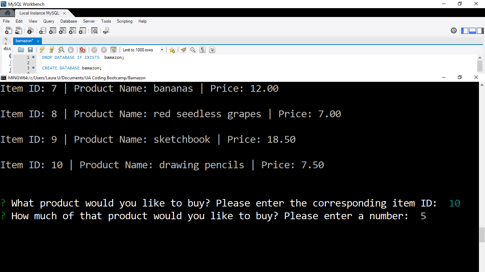
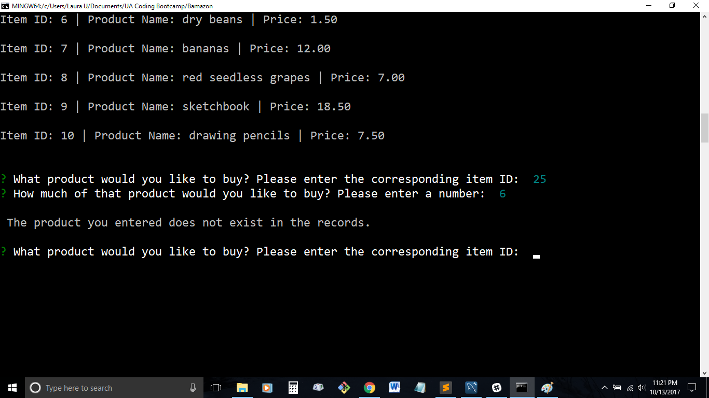
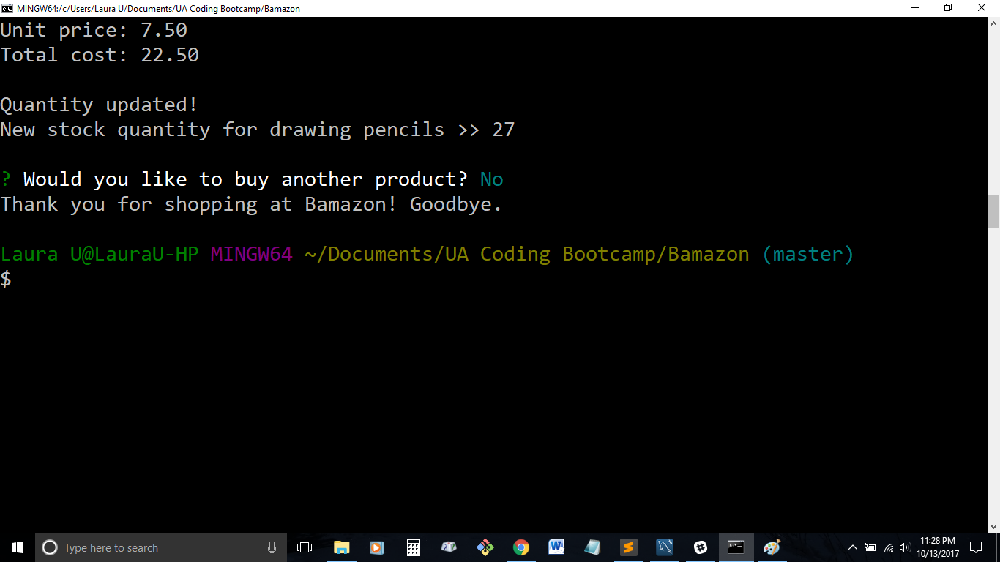
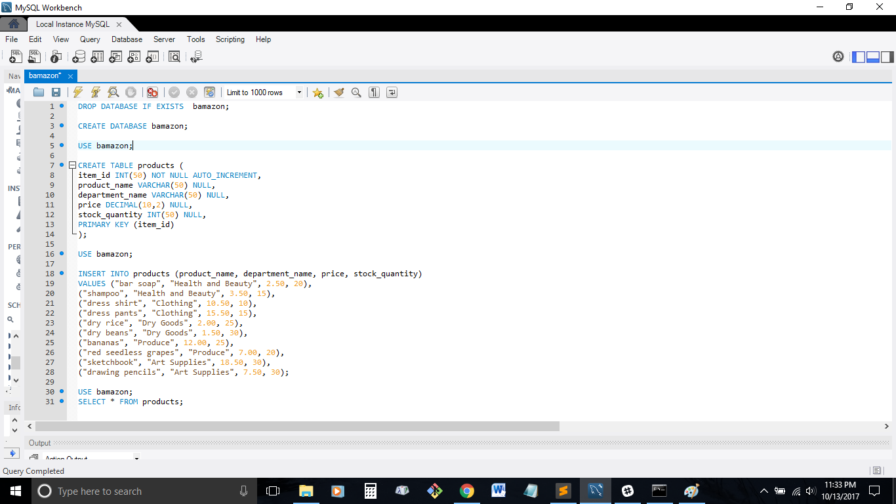
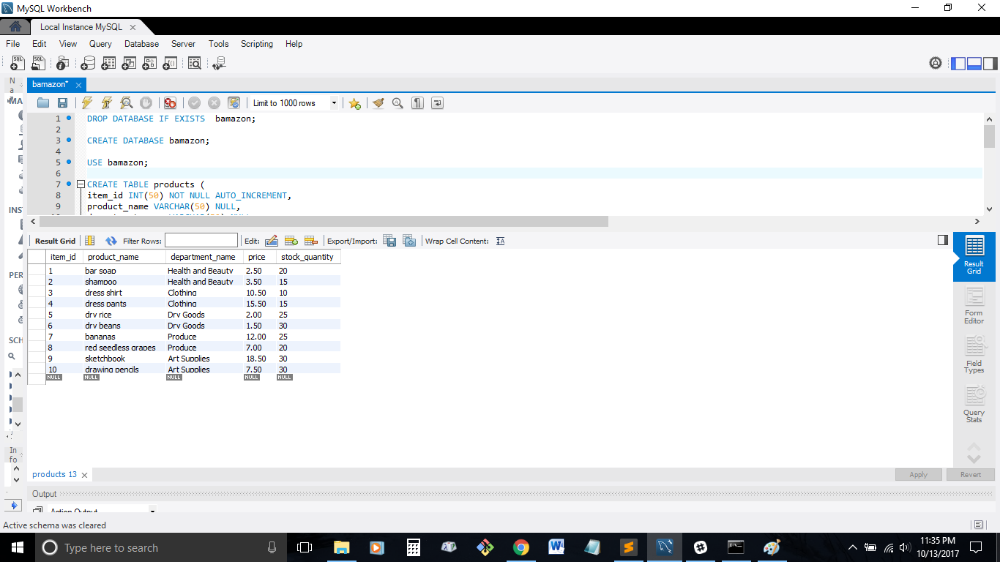
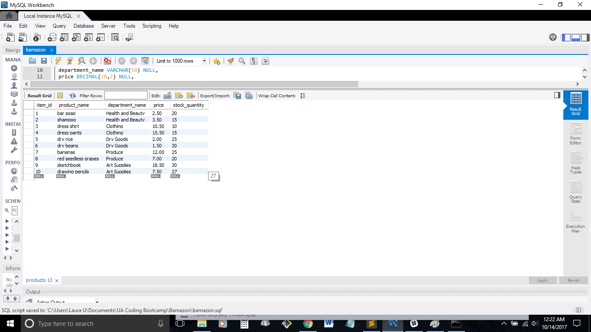

# Bamazon

## About
This command line interface app allows users to purchase items off of a fictitious store called Bamazon. The app utilizes Node.js and MySQL.

Dependencies:
* Inquirer NPM
* MySQL NPM

## Getting Started
* First, download the repository.

* Next, using the command line, direct to where the folder Bamazon was downloaded on your system.

* From here, start the app by typing into the command line `node bamazonCustomer.js` and hit enter.

* To quit the program at any time, type `ctrl + C`.

## Using the App
Once the app is started you will be shown a pre-loaded list of products, their Item IDs, and their prices.

You will be prompted with two questions asking what product you are interested in buying and the quantity you would like to have. Select the item you want by typing in the Item ID number and hitting enter. Choose the item quantity by typing in a number and hitting enter. 

- - -
**NOTE:** 
Choosing an Item ID number that isn't on the list will throw an error message and prompt you again to choose a product to buy.

Also, choosing a quantity that exceeds what's in stock will throw an error message, followed by prompting you again to choose a product to buy.

- - - 

Once you have made your choices, the app will display the product you purchased, the quantity, the unit price, and your total cost.

You will also see a message that the stock quantity for that item has been updated, followed by the product's new quantity. 

From here, the app will prompt you again if you would like to make another purchase or not. Type `y` for "yes" or `n` for "no" and hit enter. 

Selecting yes will restart the prompts from above asking what product you would like and how many. Selecting no will give you a goodbye message and end the program.

## Behind the Scenes
The app is pulling all data on the products from the MySQL database "bamazon." The database contains one table called "products."

Each time a user selects a product/quantity to purchase, the database updates the product's stock quantity.

Product table before user buys any products...

Product table after user buys 3 drawing pencils and database updates...
